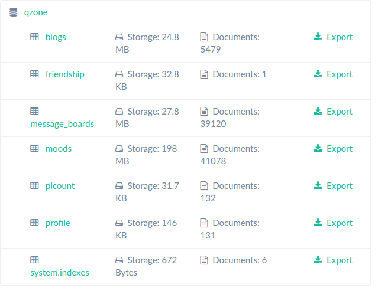
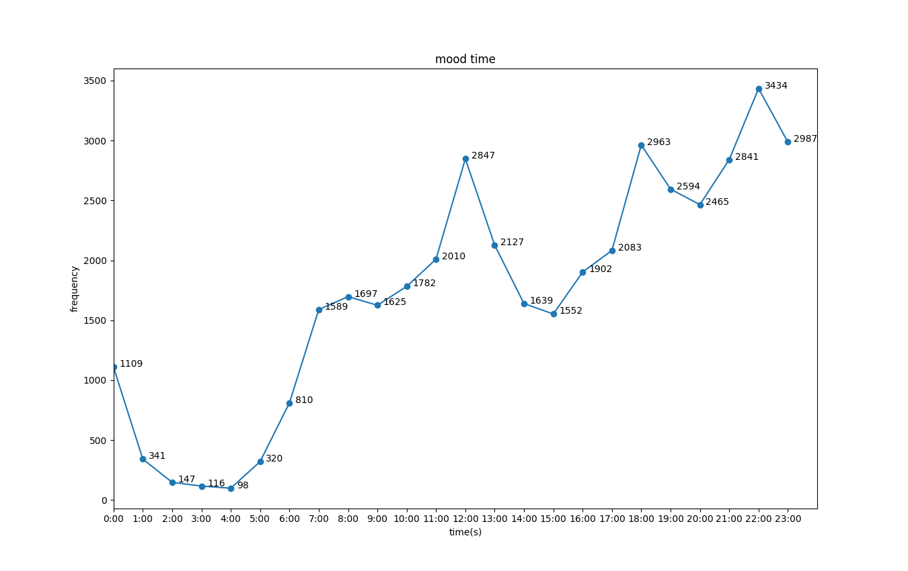
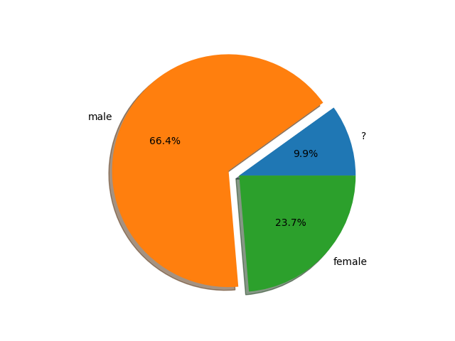
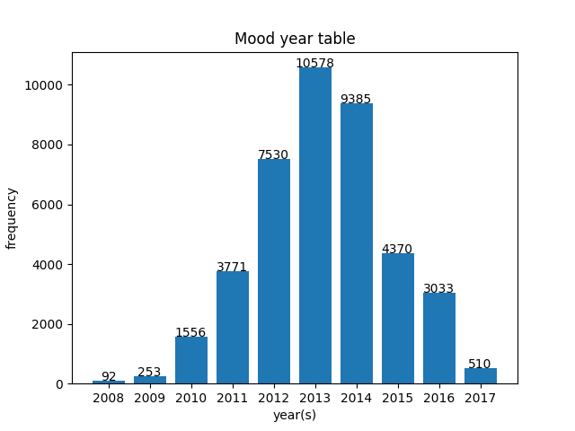

qzonebot
========

qzonebot是一个简单的QQ空间数据爬取机器人。

## 功能说明

**功能**

* 抓取所有好友的个人档
* 抓取所有好友的说说及附带评论
* 抓取所有好友的日志（看样子日志现在几乎没人用了）
* 抓取所有好友的留言
* 抓取所有好友的说说、留言、日志、相册数目
* 批量点赞（或取消点赞）
* 交互式环境评论说说（范例`qzonebot.py`实现了一个使用机器人批量评论的小例子）
* 交互式环境回复评论
* 目前只支持二维码扫码登录

**说明**

* 除了抓取日志外，其他过程都是无痕进行。（日志页面太老，得从HTML页面中提取）
* 不要天真，不要想着想着越权访问。
* 账号可能会被“安全保护”两小时无法使用，绑定微信的话，微信同样不能幸免。所以**节制批量点赞、批量评论、批量抓取日志**，其它无妨。

## Todo

* 实时点赞、实时评论（可能会被好友拉黑，还是不要写了）
* 对抓取的数据进行数据分析（虽然只有很少量的数据），总得让这些数据有点用吧。

## 使用

**Python库**

* BeautifulSoup
* json
* requests
* pymongo
* PIL

```bash
pip install BeautifulSoup json requests pymongo PIL
```

**MongoDB**

安装并启动MongoDB数据库。（自己玩，使用默认主机(localhost)和端口）

**使用**

克隆或下载本库，在交互式环境下可以很方便的进行测试。

**登录**

```python
>>> import core
>>> client = core.Client() 
>>> client.login() # 登录过程有彩蛋
```

之后就可以在交互式环境中进行测试了。
```python
# 范例：获取所有好友
>>> rep = client.get_friends()
>>> data = json.loads(core.jscallbck2dict(rep.text))
>>> friends = data['data']
...
```

更多函数的使用可直接阅读源码注释。

**范例**

文件`qzonebot.py`是一个根据图灵机器人评论指定好友所有说说的详细的例子，

## 结果展示

下图是抓取结果展示：



数据库说明：

* blogs： 日志
* friendship： 好友关系
* message_boards： 留言
* moods： 说说
* plcount： 空间说说、留言、日志、相册的数量
* profile： 个人档

**简单的数据分析**

`analyze`目录下是两个示例小程序，`private.py`可以分析指定好友发动态的时间规律，`public.py`分析了全部好友发说说时间的规律、性别比例、每年说说总数等。



可以看到中午12:00~13:00，下午06:00~07:00，22:00~23:00是高峰，晚上入睡前尤甚，半夜02:00~05:00大家基本都处于睡熟状态。



 (@.@)<br/>
<)&nbsp; &nbsp;)> &nbsp; 性别比例，不必多说。<br/>
&nbsp; / &nbsp;&nbsp;&nbsp;\



每年发说说的总数，呈现先上升后下降的规律（没考虑有删除旧动态的情况），目前趋势是逐年减少。
